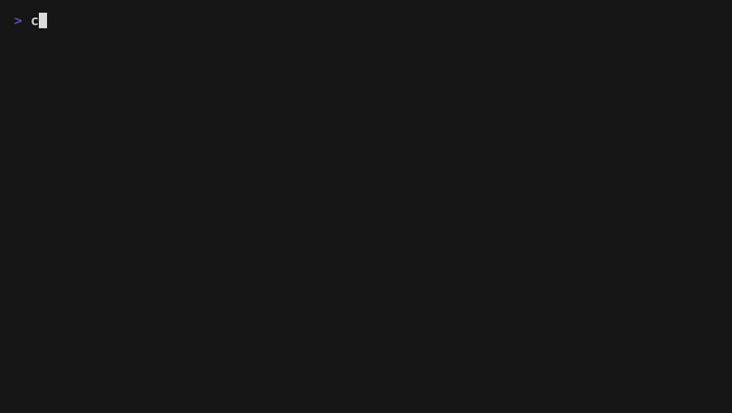

# convert-md-to-bbcode 📊

<!-- prettier-ignore-start -->


[](https://www.npmjs.com/package/convert-md-to-bbcode)
[](https://badge.fury.io/js/convert-md-to-bbcode)
[](https://www.npmjs.com/package/convert-md-to-bbcode)
[](https://packagephobia.com/result?p=convert-md-to-bbcode)
[](https://piecioshka.mit-license.org)
[](https://github.com/piecioshka/convert-md-to-bbcode/actions/workflows/ci.yml)


<!-- prettier-ignore-end -->

🔨 Convert Markdown to BBCode.

> Give a ⭐️ if this project helped you!

## Motivation

TradingView script publication descriptions do not render Markdown. They accept a small set of BBCode tags instead ([documented in the Pine Script docs](https://www.tradingview.com/pine-script-docs/writing/publishing/)): `[b]`, `[i]`, `[s]`, `[pine]`, `[list]`, `[list=1]`, `[*]`, `[quote]`, `[url=...]`, `[image]`. If you keep your indicator documentation in Markdown (e.g. next to the `.pine` files in a repository), publishing means converting the same document over and over by hand. This tool does that conversion in one command.

## Preview 🎉



## Where BBCode is required 📍

Markdown became the default almost everywhere, but a surprising number of platforms still speak BBCode only:

- ✅ [TradingView](https://www.tradingview.com/) - script publication descriptions _(the primary target of this tool)_
- ✅ [phpBB](https://www.phpbb.com/) forums
- ✅ [XenForo](https://xenforo.com/) communities
- ✅ [vBulletin](https://www.vbulletin.com/) and [MyBB](https://mybb.com/) boards
- ✅ [Bitcointalk](https://bitcointalk.org/) and most cryptocurrency forums
- ✅ [Steam](https://steamcommunity.com/) guides, profiles and workshop pages
- ✅ [ProBoards](https://www.proboards.com/) and [Invision Community](https://invisioncommunity.com/) sites

<!-- prettier-ignore-start -->

> [!NOTE]
> The output targets the TradingView dialect, but `[b]`, `[i]`, `[s]`, `[url=...]`, `[list]` and `[quote]` are the common BBCode core, so it works on classic forums too. The differences are `[image]` (many engines use `[img]` instead) and `[pine]` (TradingView-only; other engines use `[code]`).

<!-- prettier-ignore-end -->

## Features ✨

- 🔄 Converts bold, italic, strikethrough, links and images to their BBCode tags
- ⌨️ Maps inline code to `[b]` _(the dialect has no inline-code tag)_
- 🧱 Renders headings as plain `[b]` lines _(BBCode has no headers)_
- 🎨 Optional `--pinecoders` style renders `##` headings as `█ [b]SECTION[/b]` lines and drops the first H1 _(the TradingView publication convention; the publish form has its own title field, `--keep-h1` restores it)_
- 📐 Puts fenced code blocks and tables into `[pine]` blocks, so monospace keeps ASCII diagrams and columns aligned
- 📋 Preserves list nesting with nested `[list]` / `[list=1]` tags
- 🔗 Degrades relative links to plain text _(they would point nowhere outside the repository)_
- 📦 Zero dependencies
- 📘 Ships TypeScript types and a programmatic API

## Usage

Installation:

```bash
npm install convert-md-to-bbcode
```

```javascript
import { convertMarkdownToBBCode } from 'convert-md-to-bbcode';

// Faithful conversion: every heading becomes a plain [b] line
const bbcode = convertMarkdownToBBCode('# Title\n\n**Bold** text');

// TradingView publication style: `█ [b]SECTION[/b]` headings, first H1 dropped
const description = convertMarkdownToBBCode('# Title\n\n**Bold** text', {
  style: 'pinecoders',
});
```

## CLI

Try it without installing anything:

```bash
npx convert-md-to-bbcode docs/indicator.md
```

Or install globally:

```bash
npm install -g convert-md-to-bbcode
```

```bash
convert-md-to-bbcode docs/indicator.md                  # BBCode to stdout
convert-md-to-bbcode docs/indicator.md --out desc.txt   # write to a file
cat docs/indicator.md | convert-md-to-bbcode            # read from stdin
convert-md-to-bbcode docs/indicator.md --pinecoders     # TradingView publication style
convert-md-to-bbcode docs/indicator.md --pinecoders --keep-h1   # ...but keep the top H1
```

Paste-ready: send the result straight to the clipboard and paste it into the publish form:

```bash
convert-md-to-bbcode docs/indicator.md | pbcopy                       # macOS
convert-md-to-bbcode docs/indicator.md | xclip -selection clipboard   # Linux (X11)
convert-md-to-bbcode docs/indicator.md | wl-copy                      # Linux (Wayland)
```

## Development 🛠️

```bash
npm install
npm test             # unit tests
npm run coverage     # unit tests with a coverage report
npm run lint         # ESLint
npm run format       # Prettier over the whole repository
```

## 🤝 Contributing

Contributions, issues and feature requests are welcome!<br /> Feel free to check [issues page](https://github.com/piecioshka/convert-md-to-bbcode/issues/).

## License

[The MIT License](https://piecioshka.mit-license.org) @ 2026
